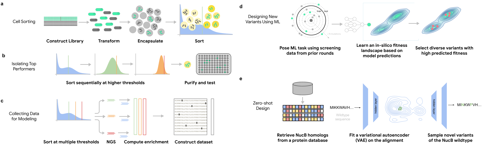
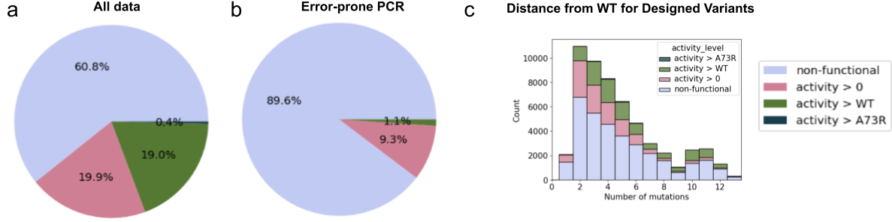

# ML-Guided Directed Evolution for Engineering a Better Nuclease Enzyme

This repository accompanies the paper "Engineering highly active and diverse nuclease enzymes by combining machine learning and ultra-high-throughput screening"

<!-- (TODO: bioarxiv link) -->

<div style="width:70%; margin: auto;">

</div>

## Analyzing our enzyme activity dataset
You can use our dataset of estimated enzyme activity for 55K NucB variants to develop new machine learning models or to generate new insights about NucB. 

A simple notebook has been provided to load and analyze the data: [](https://colab.research.google.com/github/google-deepmind/nuclease_design/blob/main/notebooks/plot_landscape_analysis.ipynb
)


<div style="width:70%; margin: auto;">

</div>

## Reproducing the paper's analysis

All figures and tables in the paper can be reproduced by notebooks in [notebooks/](https://github.com/google-deepmind/nuclease_design/tree/main/notebooks). 

Each notebooks can be run as-is, since it loads pre-computed enrichment factor data from GCS (see below). To regenerate the analysis from the raw NGS count data, run
[get_enrichment_factor_data.ipynb](https://github.com/google-deepmind/nuclease_design/tree/main/notebooks/get_enrichment_factor_data.ipynb)
with a local value of `DATA_DIR` and then change `DATA_DIR` in the analysis notebooks and re run them. 

These notebooks, and the library code they call, can be used to dig deeper into our results or to provide a jumping-off point for creating your own genotype-phenotype dataset based on count data from high-throughput sorting.

## Analyzing our libraries and models
Some useful starting points:

* Analyze the hit rates of various library design methods [](https://colab.research.google.com/github/google-deepmind/nuclease_design/blob/main/notebooks/plot_hit_rates.ipynb
)
* Analyze the diversity of hits from these libraries [](https://colab.research.google.com/github/google-deepmind/nuclease_design/blob/main/notebooks/plot_diversity.ipynb
)
* Play with the CNN model used for the final round of sequence design [](https://colab.research.google.com/github/google-deepmind/nuclease_design/blob/main/notebooks/analyze_cnn.ipynb
)

## Data
All data is available in a Google cloud storage (GCS) [bucket](https://storage.googleapis.com/nuclease-design-data). We don't recommend directly downloading it; the above scripts use helper functions for loading from the bucket.

The bucket contains the following sub-directories:

*   `raw_count_data`: raw NGS count data for pre-sort and post-sort populations.

*   `processed_fiducial_data`: enrichment factors for synonyms of various
    'fiducial' sequences. Each row represents a distinct DNA sequence that
    translates to the same amino acid sequence.

*   `processed_data`: enrichment factors computed from the raw count data and
    the processed fiducial data. Each row represents a unique amino acid
    sequence. For each row and each fiducial, the row is assigned a p-value for
    observing its enrichment factor under the null distribution of enrichment
    factors from the fiducial.

*   `processed_data/landscape.csv`: A single file that merges data from all 4
    rounds of experiments and provides a multi-class catalytic activity
    labels for 56K distinct amino acid sequences.

*   `plate_data`: Data from the low-throughput purified protein experiments used
    to confirm hits.

*   `library_designs`: A mapping from amino acid sequences to the list of the
    names of the sub-libraries (corresponding to different sequence design
    methods) that proposed it. Note that some sequences were proposed by
    multiple methods.

*   `analysis`: Data used for creating certain tables and results in the paper
    that require expensive computations, such as clustering hits in order to
    quantify diversity.

*   `alignments`: A multiple sequence alignment used to fit our VAE model.

## Running unit tests

The notebooks directly install this package from GitHub, so no installation is
necessary. However, you can locally install this package in order to run tests using the following commands:

Note that our package requires **python >= 3.10.**

```
venv=/tmp/nuclease_design_venv
python3 -m venv $venv
source $venv/bin/activate
pip install -e .
python -m pytest nuclease_design/*test.py
```


<!-- ## Citing this work

TODO: update this when a bioarxiv link is available. -->


## License and disclaimer

Copyright 2023 DeepMind Technologies Limited

All software is licensed under the Apache License, Version 2.0 (Apache 2.0);
you may not use this file except in compliance with the Apache 2.0 license.
You may obtain a copy of the Apache 2.0 license at:
https://www.apache.org/licenses/LICENSE-2.0

All other materials are licensed under the Creative Commons Attribution 4.0
International License (CC-BY). You may obtain a copy of the CC-BY license at:
https://creativecommons.org/licenses/by/4.0/legalcode

Unless required by applicable law or agreed to in writing, all software and
materials distributed here under the Apache 2.0 or CC-BY licenses are
distributed on an "AS IS" BASIS, WITHOUT WARRANTIES OR CONDITIONS OF ANY KIND,
either express or implied. See the licenses for the specific language governing
permissions and limitations under those licenses.

This is not an official Google product.


